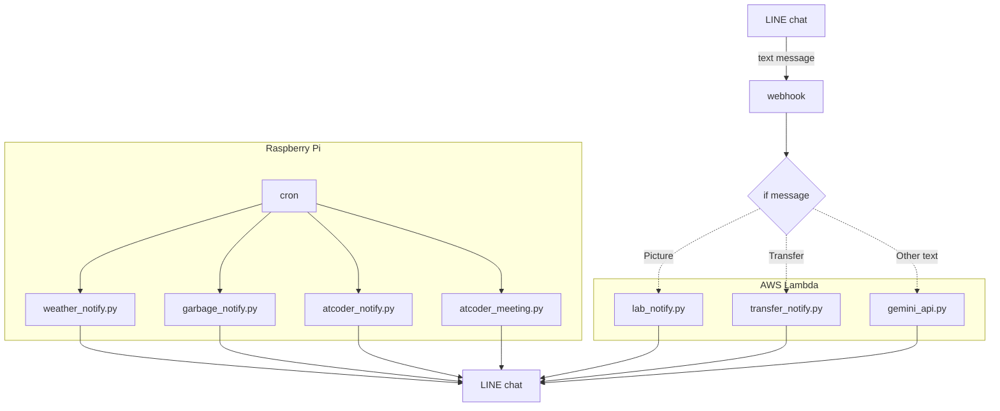

<p>


</p>

# line-bot<!-- TODO 書く -->

LINEのBotを構成するシステムです。ここではcronを用いた自動送信、webhookを用いたメッセージへの返信を実現しています。

# DEMO


# Features
### weather_notify.py
スクレイピングにより、任意の地点における天気、最高気温、最低気温を取得します。
### garbage_notify.py
町田市のゴミ出しを通知するPythonコードです。
### atcoder_notify.py
AtCoderのABCコンテストを通知するPythonコードです。
### atcoder_meeting.py
コンテスト終了後にGoogle MeetのURLを通知するコードです。
### lab_notify.py
研究室の写真を送信するコードです。
### transfer_notify.py
任意の地点間における乗換案内を送信するコードです。
### gemini_api.py
条件に合わないテキストを送信した際に、Geminiが返信します。

# Requirement

* Python 3.9.2
* beautifulsoup4 4.9.3
* line-bot-sdk 3.5.1
* requests 2.31.0
* python-dotenv 1.0.1 (Additional)

# Installation

Install PyDrive (and python-dotenv) with pip command.

pipコマンドでPyDrive(、python-dotenv)をインストールしてください。

```bash
pip３ install beautifulsoup4
pip3 install line-bot-sdk
pip3 install requests
pip3 install python-dotenv # Additional
```

# Usage
Clone the repository and Run "main.py" in the directory.

リポジトリをクローンし、ディレクトリ内にあるPythonコードを実行してください。

```bash
git clone https://github.com/daikidaiku/line-bot
cd line-bot
python3　hogehoge.py
```

# Note

LINEのトークンやAWSの設定は適宜行ってください。（後日追記予定）

# Author

* daiki_daiku
* Waseda University
* Twitter : https://twitter.com/daiki_da1ku

# License

upload-lab-photo is under [MIT license](https://en.wikipedia.org/wiki/MIT_License).